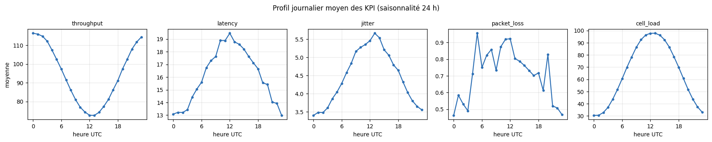
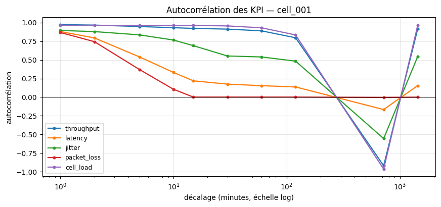
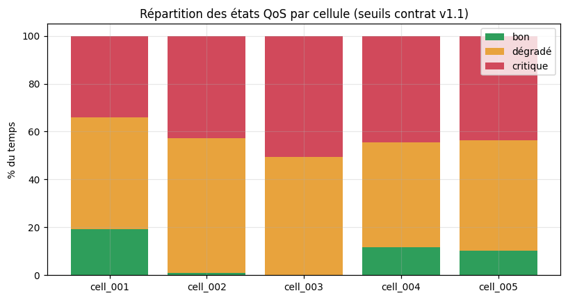

# Rapport d'analyse exploratoire — Binôme B

**Jalon J7** · contrat d'interface v1.1 · source de données : `CSV local — historical_kpi.csv`

Généré par `python -m src.scripts.run_eda`. Figures dans `reports/figures/eda/`.

---

## 1. Périmètre et conformité au contrat

| Élément | Valeur |
|---|---|
| Lignes servies | 100,800 |
| Cellules | 5 |
| Période couverte | 2026-08-02 15:48:00+00:00 → 2026-08-16 15:47:00+00:00 |
| Durée | 14.0 jours |
| Valeurs imputées (`is_missing`) | 0.0 % |
| Valeurs nulles résiduelles | 0 |
| Taux d'anomalie (vérité terrain) | 1.2778 % |

**Contrôles de conformité** : aucune

Conséquence pour la modélisation : avec un taux d'anomalie de
1.2778 %, l'exactitude (*accuracy*) est inutilisable
comme métrique — un modèle prédisant « jamais d'anomalie » atteindrait
98.72 %. L'évaluation repose donc sur
précision / rappel / F1 et sur la matrice de confusion, conformément au §4.3 de
la fiche.

---

## 2. Statistiques descriptives

|             |   count |   mean |    std |   min |    5% |   25% |   50% |    75% |    95% |    99% |    max | unite   |   skew |
|:------------|--------:|-------:|-------:|------:|------:|------:|------:|-------:|-------:|-------:|-------:|:--------|-------:|
| throughput  |  100800 | 94.434 | 22.514 |  2.7  | 63.41 | 77.12 | 93.19 | 107.65 | 141.8  | 150.74 | 159.66 | Mbit/s  |  0.475 |
| latency     |  100800 | 16.074 |  6.322 |  6.72 | 10.13 | 12.69 | 15.17 |  18.47 |  23.91 |  26.09 | 260.84 | ms      | 12.56  |
| jitter      |  100800 |  4.461 |  1.228 |  1.8  |  3.04 |  3.73 |  4.35 |   5.13 |   5.87 |   6.29 |  29.11 | ms      |  6.624 |
| packet_loss |  100800 |  0.711 |  2.183 |  0    |  0.24 |  0.47 |  0.63 |   0.79 |   1.03 |   1.22 |  79.64 | %       | 28.262 |
| cell_load   |  100800 | 64.821 | 24.907 | 12.29 | 28.49 | 40.84 | 65.18 |  89.21 | 100    | 100    | 100    | %       | -0.044 |

---

## 3. Séparabilité normal / anomalie

Écart des moyennes entre régime normal et régime anormal, exprimé en écarts-types
du régime normal. Une séparabilité > 1 σ désigne un KPI directement discriminant.

| kpi         | unite   |   moy_normal |   moy_anomalie |   ecart_relatif_pct |   separabilite_sigma |
|:------------|:--------|-------------:|---------------:|--------------------:|---------------------:|
| packet_loss | %       |        0.626 |          7.234 |             1055.31 |               28.117 |
| latency     | ms      |       15.786 |         38.309 |              142.68 |                5.53  |
| jitter      | ms      |        4.412 |          8.276 |               87.61 |                4.385 |
| throughput  | Mbit/s  |       94.738 |         70.933 |              -25.13 |                1.082 |
| cell_load   | %       |       64.788 |         67.337 |                3.93 |                0.102 |

Lecture : les KPI les plus discriminants doivent peser dans le détecteur ; ceux
dont la séparabilité est faible n'apportent du signal qu'en interaction avec les
autres, ce qui justifie un modèle multivarié plutôt qu'un simple seuil par KPI.

---

## 4. Saisonnalité journalière

Amplitude du profil horaire, en % de la moyenne du KPI :

|             |   amplitude_pct |
|:------------|----------------:|
| throughput  |            46.3 |
| latency     |            40.3 |
| jitter      |            50.8 |
| packet_loss |            69.4 |
| cell_load   |           103.9 |

Une saisonnalité de cette ampleur impose deux choix :
1. les features de saisonnalité (`hour_of_day`, `day_of_week`) livrées par le
   Binôme A sont converties en **encodages cycliques** sin/cos, pour éviter la
   discontinuité 23 h → 0 h ;
2. un détecteur d'anomalies doit raisonner en **écart à la normale horaire** et
   non en valeur absolue, sinon la pointe de trafic du soir est confondue avec
   une dégradation. D'où les features dérivées `*_ratio_to_hour`.

---

## 5. Corrélations et autocorrélation

Couples de KPI les plus corrélés :

- `throughput` ↔ `cell_load` : -0.68
- `jitter` ↔ `cell_load` : +0.62
- `packet_loss` ↔ `latency` : +0.57

|             |   throughput |   latency |   jitter |   packet_loss |   cell_load |
|:------------|-------------:|----------:|---------:|--------------:|------------:|
| throughput  |        1     |    -0.119 |   -0.431 |        -0.176 |      -0.682 |
| latency     |       -0.119 |     1     |    0.233 |         0.574 |       0.328 |
| jitter      |       -0.431 |     0.233 |    1     |         0.03  |       0.616 |
| packet_loss |       -0.176 |     0.574 |    0.03  |         1     |       0.05  |
| cell_load   |       -0.682 |     0.328 |    0.616 |         0.05  |       1     |

Autocorrélation (cellule de référence) :

| kpi         |   lag_1min |   lag_2min |   lag_5min |   lag_10min |   lag_15min |   lag_30min |   lag_60min |   lag_120min |   lag_720min |   lag_1440min |
|:------------|-----------:|-----------:|-----------:|------------:|------------:|------------:|------------:|-------------:|-------------:|--------------:|
| throughput  |      0.973 |      0.966 |      0.947 |       0.931 |       0.922 |       0.912 |       0.889 |        0.796 |       -0.919 |         0.916 |
| latency     |      0.88  |      0.794 |      0.54  |       0.332 |       0.219 |       0.175 |       0.154 |        0.137 |       -0.166 |         0.155 |
| jitter      |      0.894 |      0.879 |      0.835 |       0.766 |       0.69  |       0.552 |       0.539 |        0.483 |       -0.555 |         0.545 |
| packet_loss |      0.867 |      0.744 |      0.371 |       0.106 |       0.001 |       0.001 |       0.001 |        0.001 |       -0.003 |         0     |
| cell_load   |      0.964 |      0.963 |      0.963 |       0.962 |       0.962 |       0.955 |       0.93  |        0.834 |       -0.963 |         0.963 |

Lecture : l'autocorrélation reste élevée jusqu'à quelques dizaines de minutes
puis décroît. C'est le fondement du choix des modèles de prévision — les lags
courts (1, 5, 10 min) livrés par le Binôme A portent l'essentiel du signal à
horizon 5–30 min, ce qui favorise un modèle autorégressif (XGBoost sur lags)
plutôt qu'un modèle à composantes tendance/saisonnalité.

---

## 6. États QoS et validation des seuils figés

Répartition globale obtenue avec les seuils du contrat v1.1, agrégation par la
règle du pire KPI :

| etat     |     n |   pct |
|:---------|------:|------:|
| bon      |  8395 |  8.33 |
| dégradé  | 48964 | 48.58 |
| critique | 43441 | 43.1  |

Répartition par cellule (% du temps) :

| cell_id   |   bon |   dégradé |   critique |
|:----------|------:|----------:|-----------:|
| cell_001  | 19.07 |     46.88 |      34.05 |
| cell_002  |  0.81 |     56.38 |      42.81 |
| cell_003  |  0    |     49.5  |      50.5  |
| cell_004  | 11.55 |     44.04 |      44.41 |
| cell_005  | 10.21 |     46.08 |      43.71 |

### 6.1 Diagnostic : les seuils v1.1 sont déséquilibrés

Une plateforme de supervision qui déclare l'état **critique 43.1 % du temps**
et l'état « bon » seulement **8.3 % du temps** n'est pas
exploitable : l'alerte perd sa valeur de signal. La décomposition KPI par KPI
identifie la cause.

État par KPI pris isolément (% du temps) :

| kpi         |   bon |   dégradé |   critique |
|:------------|------:|----------:|-----------:|
| throughput  | 25.82 |     49.38 |      24.79 |
| latency     | 81.8  |     17.91 |       0.29 |
| jitter      | 36.23 |     37.89 |      25.87 |
| packet_loss | 30.54 |     56.82 |      12.63 |
| cell_load   | 54.46 |     21.68 |      23.86 |

Le mécanisme est arithmétique. Chaque KPI est classé « bon » entre
26 % et 82 % du temps
selon l'indicateur. L'agrégation par la règle du pire KPI exige que **les cinq**
KPI soient simultanément bons : si les KPI étaient indépendants, la part de temps
« bon » global tomberait à 1.27 %. On observe
8.33 %, l'écart provenant de la corrélation entre KPI (§5) qui
regroupe partiellement les dégradations sur les mêmes instants.

Autrement dit : **les seuils ont été calibrés indicateur par indicateur, sans
tenir compte de la règle d'agrégation qui les combine.** Les percentiles retenus
par le Binôme A sont défendables KPI par KPI (`latency` est bon 82 % du temps),
mais `throughput` (`good_min` = 107 Mbit/s) ne laisse que
25.8 % du temps en « bon », et `jitter`
(`good_max` = 4,0 ms) 36.2 % — ces deux seuils
tirent l'état global vers le bas à eux seuls.

**Position du Binôme B** : le contrat v1.1 est gelé et nous ne le modifions pas
unilatéralement — le respecter est le facteur de réussite n°1 identifié au §8.2
de la fiche. Les seuils servis par `GET /api/v1/thresholds` restent donc la
référence dans tout le code. Nous demandons en revanche au Binôme A une révision
en **v1.2** selon l'une des deux options suivantes :

- *option A — recalibrer par la cible d'agrégation* : fixer les `good_*` de sorte
  que l'état global « bon » représente la part de temps visée (typiquement
  60–70 %), ce qui revient à relâcher `throughput` et `jitter` ;
- *option B — changer la règle d'agrégation* : conserver les seuils et remplacer
  la règle du pire KPI par une règle à quorum (état critique si ≥ 2 KPI
  critiques), documentée dans le contrat.

L'option A est préférable : elle garde une règle d'agrégation simple et
explicable à un exploitant. Cette décision appartient au Binôme A, propriétaire
de l'endpoint ; le dashboard expose le déséquilibre pour que la discussion se
tienne sur des chiffres.

### 6.2 Les seuils ne remplacent pas un détecteur d'anomalies

Croisement état QoS (règles de seuils) × vérité terrain `is_anomaly`, en % par colonne :

| qos_state   |   False |   True |
|:------------|--------:|-------:|
| bon         |    8.43 |   0.85 |
| dégradé     |   49.03 |  13.35 |
| critique    |   42.54 |  85.79 |

Lecture — c'est le résultat déterminant pour le cadrage des modèles. Les seuils
seuls ne suffisent pas à identifier les anomalies : une part des points anormaux
reste classée « bon » ou « dégradé » (anomalies de forme et non d'amplitude —
dérive progressive, gigue anormale à charge normale), et surtout la colonne
`False` montre que 43 % des points
**normaux** sont déjà classés « critique ». Un exploitant qui se fierait aux
seuls seuils recevrait donc une majorité de fausses alertes.

**La classification par seuils et la détection d'anomalies apprise sont deux
fonctions complémentaires, non redondantes** : la première qualifie l'état
d'exploitation au sens du SLA, la seconde signale l'atypique. C'est la
justification du travail de modélisation qui suit.

---

## 7. Décisions de cadrage des modèles

| Question | Décision | Motif tiré de l'EDA |
|---|---|---|
| Détection d'anomalies | non supervisée, multivariée, sur écarts à la normale horaire | séparabilité inégale entre KPI (§3) ; saisonnalité forte (§4) |
| Baselines anomalie | seuils contractuels + Isolation Forest + DBSCAN | il faut une référence explicable avant tout modèle appris |
| Modèle avancé anomalie | autoencodeur (erreur de reconstruction) | capte les anomalies de forme que les seuils manquent (§6) |
| Prévision | modèle autorégressif sur lags courts | autocorrélation dominante à 5–30 min (§5) |
| Baselines prévision | persistance + moyenne mobile + ARIMA | référence obligatoire avant modèle avancé (§8.2 de la fiche) |
| Modèle avancé prévision | XGBoost multi-horizon | non-linéarités et interactions entre KPI corrélés (§5) |
| Métriques anomalie | précision / rappel / F1 / PR-AUC | déséquilibre à 1.2778 % (§1) |
| Métriques prévision | MAE / RMSE / MAPE + comparaison à la persistance | exigence §4.3 de la fiche |
| Découpage | chronologique par cellule, avec purge de 60 min | fenêtres glissantes de 60 min dans les features du Binôme A |

---

## 8. Réserves adressées au Binôme A

Contrôles automatiques de conformité du flux servi :

- aucune

Demandes de révision, par ordre de priorité :

1. **Recalibrage des seuils QoS (v1.2)** — cf. §6.1. L'état « bon » ne couvre que
   8.3 % du temps et l'état « critique » 43.1 %.
   Seuils principalement en cause : `throughput.good_min` et `jitter.good_max`.
   Nous continuons d'utiliser les seuils v1.1 tant que la révision n'est pas actée.
2. **`GET /eval/labels` : horodatages non rééchantillonnés.** L'endpoint sert les
   `ts` de `raw_kpi_measurements` (ex. `20:21:41`) alors que `/kpi/history` et
   `/features` sont rééchantillonnés à la minute pleine (`20:21:00`). Une jointure
   sur `(ts, cell_id)` n'apparie donc **aucune** ligne : la prévalence mesurée
   tombe à 0 % et toutes les métriques de détection s'effondrent à zéro, sans la
   moindre erreur levée. Un endpoint d'évaluation inutilisable pour évaluer est un
   défaut bloquant. Contourné côté B par un réalignement sur la grille minute
   (agrégation par `max`), et protégé par un garde-fou `LabelAlignmentError`.
   Correction attendue : servir les `ts` alignés sur `clean_kpi_measurements`.
3. **`GET /eval/labels` : enveloppe de réponse incomplète.** L'endpoint accepte
   `limit` et `offset` mais son enveloppe omet `limit`, `offset`, `total` et
   `has_more`, contrairement au contrat que le README du binôme A énonce
   lui-même. Un client qui déroule la pagination sur `has_more` s'arrête après une
   seule page : 5 000 étiquettes lues sur 100 800, en silence. Contourné côté B
   par l'heuristique « continuer tant que la page est pleine ».
4. **Mise à jour du §5 de `data_dictionary.md`** — la liste d'endpoints y figurant
   (`/kpi/raw`, `/kpi/clean`, `/stream/latest`) ne correspond plus à l'API v1.1
   réellement servie. Le document du contrat doit refléter l'implémentation.
5. **Pipeline non idempotent — vérifié sur la stack Docker.** `clean_prepare` et
   `build_features` relisent la table amont en entier et insèrent en `append` sur
   des tables à clé primaire `(ts, cell_id)`. La seconde exécution de
   `run_pipeline` échoue sur
   `psycopg2.errors.UniqueViolation: duplicate key value violates unique
   constraint "4_clean_kpi_measurements_pkey"`. Les données ne sont pas corrompues
   (la transaction est annulée), mais **le rafraîchissement périodique est
   impossible** : le DAG Airflow, planifié toutes les 15 minutes, échouera à chaque
   exécution après la première. Le paramètre `since` existe dans les deux fonctions
   mais n'est jamais transmis, ni par `run_pipeline.py` ni par le DAG.
6. **`docker-compose.yml` était absent du dépôt** — livrable commun attendu au §6.1
   (« démarrable en une commande ») et référencé par les trois README ainsi que par
   le Dockerfile Airflow. Aucune commande de démarrage documentée ne fonctionnait,
   et l'intégration A ↔ B était donc intestable. Le Binôme B en a produit une
   version de travail à la racine, avec laquelle la chaîne complète a été validée
   (base peuplée, API servie, dashboard lisant l'API). Les services `timescaledb`,
   `api` et `airflow` relèvent du Binôme A : à relire et à reprendre, notamment sur
   le nom de la base et le stockage des métadonnées Airflow (points signalés en
   commentaire dans le fichier).
