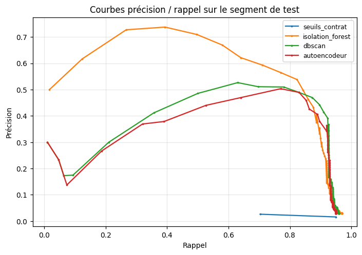
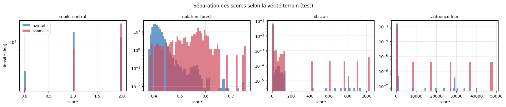
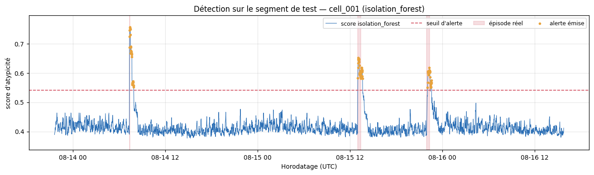
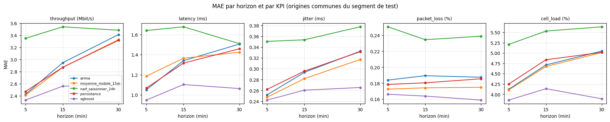
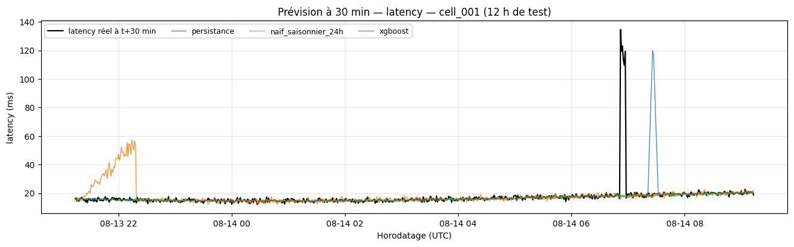
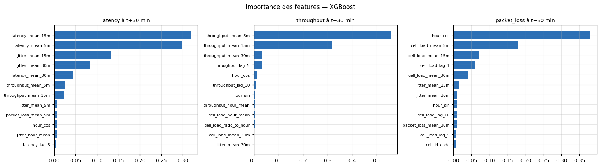

# Rapport d'évaluation des modèles — Binôme B

**NetQoS-AI** · contrat d'interface v1.1 · livrable §6.3 de la fiche de stage

Rapport **généré** par `python -m src.scripts.make_report` à partir des fichiers de
`reports/metrics/`. Aucun chiffre n'y est saisi à la main : il se régénère à
l'identique après chaque réentraînement.

---

## 1. Protocole d'évaluation

### 1.1 Découpage temporel

Découpage strictement chronologique, **cellule par cellule** : 60 % entraînement,
20 % validation, 20 % test. Deux précautions qui vont au-delà de l'exigence
minimale du §4.3 de la fiche :

- **Découpage par cellule** et non global. Les features étant calculées par
  `cell_id`, un découpage sur le timestamp global mélangerait des cellules dont
  les historiques ne se recouvrent pas exactement.
- **Purge de 60 minutes** en tête des segments de validation et de test. Les
  features du contrat contiennent des fenêtres glissantes allant jusqu'à 60 min
  (`*_hour_mean`, `cell_load_hour_max`) : sans purge, les premières lignes de
  validation résument des mesures appartenant à l'entraînement. C'est une fuite
  discrète, qui gonfle les performances annoncées.

Le contrôle `TemporalSplit.assert_chronological()` vérifie à chaque exécution
qu'aucun timestamp de test ne précède un timestamp d'entraînement.

### 1.2 Étanchéité de la vérité terrain

`is_anomaly` n'est lue que par `loader.load_labels()`, appelée exclusivement au
moment du calcul des métriques. Le module de préparation maintient une liste
`FORBIDDEN_FEATURES` et lève `LeakageError` si l'une de ces colonnes atteint une
matrice de features. Aucun `fit()` du projet ne reçoit d'étiquette.

### 1.3 Métriques

| Famille | Métriques |
|---|---|
| Détection d'anomalies | précision, rappel, F1, matrice de confusion, **PR-AUC**, ROC-AUC |
| Détection — exploitation | rappel par épisode, délai de détection, fausses alertes par heure |
| Prévision | MAE, RMSE, MAPE, sMAPE, biais |
| Prévision — comparaison | *skill score* de MAE relatif à la persistance |
| Chaîne complète | exactitude de l'état QoS annoncé, part de critiques manqués |

Les trois métriques d'exploitation ne figurent pas dans la liste minimale de la
fiche mais sont décisives : une précision par point ne dit pas si l'exploitant
aurait été averti, ni combien de fausses alertes il aurait dû trier.


### 1.4 Comparabilité avec ARIMA

ARIMA exige un réajustement par origine de prévision, ce qui interdit de
l'évaluer sur les 19 820 points du test. Il est donc évalué sur
600 origines régulièrement espacées, et **tous les autres modèles
sont réévalués sur ces mêmes origines** pour que les MAE soient commensurables.
Le périmètre `test_complet` reporte en parallèle les modèles rapides sur la
totalité du segment.


---

## 2. Détection d'anomalies

### 2.1 Résultats au point de fonctionnement d'exploitation

Seuil fixé au quantile de contamination visée, calculé sur le segment
d'entraînement — **aucune étiquette n'intervient**. C'est le seul point de
fonctionnement atteignable dans un déploiement réel sans historique annoté.

| detecteur        |   precision |   rappel |     f1 |   pr_auc |   roc_auc |   taux_alerte_pct |   rappel_episode |   fausses_alertes_par_heure |
|:-----------------|------------:|---------:|-------:|---------:|----------:|------------------:|-----------------:|----------------------------:|
| isolation_forest |      0.6159 |   0.6467 | 0.6309 |   0.5858 |    0.9586 |            1.5869 |           1      |                      0.0181 |
| autoencodeur     |      0.3826 |   0.3967 | 0.3895 |   0.3628 |    0.9438 |            1.5668 |           0.8889 |                      0.003  |
| dbscan           |      0.2772 |   0.1867 | 0.2231 |   0.3909 |    0.9559 |            1.0176 |           0.4444 |                      0.0181 |
| seuils_contrat   |      0.0263 |   0.7033 | 0.0507 |   0.0232 |    0.6518 |           40.4232 |           1      |                      0.5529 |

### 2.2 Résultats au point F1-optimal (borne haute)

Seuil choisi sur le segment de validation à l'aide des étiquettes, puis appliqué
au test. Les étiquettes n'entrent dans aucun `fit` : il s'agit de sélection de
modèle, pas d'entraînement supervisé. Ces chiffres constituent néanmoins une
**borne haute**, atteignable seulement si l'exploitant dispose d'un historique
d'incidents annoté.

| detecteur        |   precision |   rappel |     f1 |   pr_auc |   roc_auc |   taux_alerte_pct |   rappel_episode |   fausses_alertes_par_heure |
|:-----------------|------------:|---------:|-------:|---------:|----------:|------------------:|-----------------:|----------------------------:|
| isolation_forest |      0.6295 |   0.64   | 0.6347 |   0.5858 |    0.9586 |            1.5365 |                1 |                      0.0211 |
| dbscan           |      0.5062 |   0.8133 | 0.624  |   0.3909 |    0.9559 |            2.4282 |                1 |                      0.0453 |
| autoencodeur     |      0.501  |   0.8133 | 0.6201 |   0.3628 |    0.9438 |            2.4534 |                1 |                      0.003  |
| seuils_contrat   |      0.0263 |   0.7033 | 0.0507 |   0.0232 |    0.6518 |           40.4232 |                1 |                      0.5529 |

### 2.3 Comparaison indépendante du seuil

| detecteur        |   pr_auc |   roc_auc |
|:-----------------|---------:|----------:|
| isolation_forest |   0.5858 |    0.9586 |
| dbscan           |   0.3909 |    0.9559 |
| autoencodeur     |   0.3628 |    0.9438 |
| seuils_contrat   |   0.0232 |    0.6518 |

Deux enseignements méthodologiques :

1. **La ROC-AUC est trompeuse ici.** Elle dépasse 0,94 pour les trois détecteurs
   appris, y compris pour ceux dont la précision d'exploitation est médiocre.
   Avec une prévalence de 1.51 %, la ROC-AUC est dominée par la
   facilité à classer correctement les négatifs, qui sont écrasants. La PR-AUC,
   elle, sépare franchement les détecteurs. C'est elle qui est retenue comme
   métrique de référence.
2. **La baseline par seuils est disqualifiée.** Sa PR-AUC de
   0.023 est de l'ordre de la prévalence
   (1.51 % ≈ 0.0151), soit le niveau d'un tirage
   aléatoire. Elle atteint pourtant un rappel de 0.70 — mais
   en déclarant 40.4 % du temps en alerte, ce qui
   n'est pas exploitable. C'est la traduction chiffrée du déséquilibre des seuils
   v1.1 diagnostiqué au §6.1 du rapport d'EDA.



La lecture graphique confirme le classement : la courbe de l'Isolation Forest
domine sur toute la plage de rappel, et celle de la baseline par seuils reste
plate au ras de l'axe — une précision de l'ordre de 3 %, quel que soit le seuil.



Cette seconde figure montre *pourquoi* : la séparation des deux distributions
(normale en bleu, anormale en rouge) est nette pour l'Isolation Forest, beaucoup
plus confuse pour les autres. Un détecteur ne vaut que par le recouvrement de ces
deux densités.

### 2.4 Réglage de l'autoencodeur

Grille explorée, sélection sur la PR-AUC de validation :

| goulot       |   filtrage_extremes |   lignes_entrainement |   pr_auc_validation |
|:-------------|--------------------:|----------------------:|--------------------:|
| (16, 6, 16)  |                0.05 |                 57427 |              0.4182 |
| (20, 10, 20) |                0.02 |                 59241 |              0.403  |
| (16, 8, 16)  |                0.02 |                 59241 |              0.3989 |
| (16, 8, 16)  |                0    |                 60450 |              0.3873 |
| (12, 4, 12)  |                0.02 |                 59241 |              0.3817 |

### 2.5 Verdict baseline vs modèle avancé

L'**autoencodeur ne bat pas la baseline apprise**. Sa PR-AUC (0.363) reste inférieure à celle de l'Isolation Forest (0.586), et son F1 au point d'exploitation (0.390) est nettement en dessous (0.631). Conformément au §8.2 de la fiche — « un modèle avancé ne se justifie que s'il bat la baseline » — **le modèle retenu pour le déploiement est l'Isolation Forest**, et non l'autoencodeur.

Interprétation de cet échec — elle est instructive et non anecdotique. Comparons
l'écart de F1 entre le seuil non supervisé et le seuil optimal, qui mesure la
sensibilité de chaque détecteur au calibrage de son seuil :

| detecteur        |   ecart_f1_optimal_moins_exploitation |
|:-----------------|--------------------------------------:|
| dbscan           |                                 0.401 |
| autoencodeur     |                                 0.231 |
| isolation_forest |                                 0.004 |
| seuils_contrat   |                                 0     |

Deux détecteurs sont fortement dépendants de leur calibrage : DBSCAN
(+0.401) et l'autoencodeur (+0.231). Tous
deux fondent leur score sur une **distance ou une erreur non bornée**, dont la
distribution se déplace d'un segment temporel à l'autre : un seuil calibré sur
l'entraînement se retrouve mal placé au test. L'Isolation Forest, dont le score
est une profondeur d'isolement normalisée et bornée, ne perd que
+0.004 — c'est sa robustesse au calibrage, autant que sa
PR-AUC, qui la désigne pour le déploiement : en exploitation réelle, on ne
dispose pas d'étiquettes pour régler le seuil.

Sur ce volume de données et cet espace de features, la complexité supplémentaire
de l'autoencodeur n'achète donc rien — ni en pouvoir discriminant (PR-AUC
inférieure), ni en robustesse opérationnelle.

### 2.6 Analyse d'erreurs par épisode

Les métriques ponctuelles ne disent pas si un exploitant aurait été
averti. On raisonne donc par **épisode** : un intervalle contigu d'anomalie réelle.

| Grandeur | Valeur |
|---|---|
| Épisodes dans le segment de test | 9 |
| Épisodes détectés au moins une fois | 9 |
| Épisodes manqués | 0 |
| Durée médiane des épisodes détectés | 36 min |
| Part médiane de points détectés par épisode | 67% |

| cell_id   | debut                     |   duree_min | detecte   |   part_points_detectes |   pic_latence_ratio |   pic_packet_loss |   score_max |
|:----------|:--------------------------|------------:|:----------|-----------------------:|--------------------:|------------------:|------------:|
| cell_001  | 2026-08-14 07:22:00+00:00 |           6 | True      |                  1     |               4.565 |            78.908 |      0.7565 |
| cell_001  | 2026-08-15 13:01:00+00:00 |          25 | True      |                  0.96  |               1.019 |             0.99  |      0.6516 |
| cell_001  | 2026-08-15 21:57:00+00:00 |          27 | True      |                  0.667 |               2.205 |             2.36  |      0.6185 |
| cell_002  | 2026-08-14 06:48:00+00:00 |          32 | True      |                  0.562 |               2.014 |             2.126 |      0.5822 |
| cell_004  | 2026-08-16 01:08:00+00:00 |          36 | True      |                  0.75  |               2.232 |             2.25  |      0.6205 |
| cell_004  | 2026-08-14 19:54:00+00:00 |          38 | True      |                  0.737 |               2.133 |             2.47  |      0.603  |
| cell_004  | 2026-08-15 00:36:00+00:00 |          38 | True      |                  0.553 |               1.865 |             1.506 |      0.5851 |
| cell_002  | 2026-08-15 11:27:00+00:00 |          40 | True      |                  0.625 |               1.913 |             2.968 |      0.5902 |
| cell_004  | 2026-08-16 02:09:00+00:00 |          58 | True      |                  0.466 |               1.692 |             1.782 |      0.5873 |

Lecture : le détecteur retenu signale **tous** les épisodes du segment de test.
Il ne les couvre en revanche que partiellement — la part médiane de points
détectés par épisode est de 67%. Pour
un usage de supervision, c'est le comportement souhaitable : l'alerte est levée,
l'exploitant investigue, et la précision par point importe moins que l'absence
d'angle mort.

> **Limite statistique à énoncer clairement.** Le segment de test ne contient que
> 9 épisodes, parce que le générateur du Binôme A injecte environ un
> événement pour 2 000 points. Un rappel par épisode de 100 % sur 9 épisodes n'a
> qu'une faible puissance statistique : l'intervalle de confiance à 95 % de cette
> proportion descend à environ 70 %. **Cette métrique ne permet donc pas de
> départager les détecteurs** (les quatre atteignent 1,00), et c'est le taux de
> fausses alertes par heure qui les discrimine réellement — de 0,02/h pour
> l'Isolation Forest à 0,63/h pour la baseline par seuils, soit un facteur 30.
> Demande adressée au Binôme A : augmenter la densité d'événements injectés
> (ou allonger l'historique généré) pour obtenir une évaluation par épisode
> robuste avant la soutenance.




Chronogramme d'une cellule du segment de test : score d'atypicité, seuil
d'alerte, épisodes réels en surimpression et alertes émises. C'est la
représentation la plus directe de ce que voit l'exploitant.

### 2.7 Campagne d'optimisation : ce qu'elle a donné, et ce qu'elle a révélé

Le premier entraînement n'avait réglé que l'autoencodeur — le modèle
écarté — laissant l'Isolation Forest et XGBoost à des valeurs choisies a priori.
La campagne a comblé ce manque. Son résultat principal n'est pas un gain de
performance : c'est la démonstration qu'**il n'y avait pas de gain à prendre**, et
la mesure de ce qui plafonne réellement le système.

#### Détection d'anomalies : 30 configurations explorées

Deux leviers croisés : cinq espaces de features et six jeux d'hyperparamètres.

Les cinq meilleures configurations par PR-AUC de validation :

| espace         |   n_features |   n_estimators | max_samples   |   max_features |   pr_auc_validation |   duree_s |
|:---------------|-------------:|---------------:|:--------------|---------------:|--------------------:|----------:|
| contrat_actuel |           23 |            600 | 4096          |            1   |              0.6287 |       3.9 |
| contrat_actuel |           23 |           1000 | 2048          |            0.8 |              0.6147 |       8.3 |
| contrat_actuel |           23 |            600 | 1024          |            0.6 |              0.614  |       4.3 |
| contrat_actuel |           23 |            300 | auto          |            1   |              0.6049 |       1.5 |
| contrat_actuel |           23 |            300 | 256           |            1   |              0.6049 |       1.5 |

La meilleure configuration dépasse l'actuelle de +0.0238 de PR-AUC en
validation. Appliquée au test, elle s'est révélée **moins bonne**. Voici pourquoi.

#### Le contrôle qui invalide la recherche

Nous avons mesuré la dispersion de la PR-AUC **à configuration constante**, en ne
faisant varier que la graine aléatoire :

|   n_estimators |   pr_auc_moyenne |   ecart_type |   etendue |   n_graines |
|---------------:|-----------------:|-------------:|----------:|------------:|
|            300 |           0.5727 |       0.0315 |    0.0909 |           6 |
|           1000 |           0.5945 |       0.0127 |    0.0317 |           6 |
|           2000 |           0.5984 |       0.0053 |    0.0153 |           6 |

L'étendue due à la seule graine, à 300 arbres, est de **0.0909** — soit
3.8 fois l'écart de 0.0238 entre les deux
configurations comparées. **Toute la grille classait donc du bruit.** Sans ce
contrôle, nous aurions publié un « gain de +3.9 % »
qui n'existe pas — l'erreur exacte que le protocole d'évaluation est censé
prévenir.

Deux enseignements de méthode :

- **Aucun écart entre configurations n'est interprétable sans son incertitude.**
  Avec 220 points positifs en validation, la PR-AUC est un estimateur trop bruité
  pour départager des variantes proches.
- **Nos hypothèses sur l'espace de features étaient fausses.** Nous pensions que
  `cell_load`, dont l'EDA mesure une séparabilité de seulement 0,2 σ, diluait le
  signal. Le retirer **dégrade** la PR-AUC de validation (0,575 contre 0,605).
  Une feature faiblement discriminante seule peut contribuer en interaction avec
  les autres — c'est précisément l'argument qui justifiait un modèle multivarié.

#### Le seul gain réel : réduire la variance, pas chercher l'optimum

Le tableau de dispersion porte la solution. Passer de 300 à 2000 arbres améliore
la PR-AUC moyenne de
+4.5 %
**et divise l'écart-type par
6**.
Le diagnostic étant un problème de variance, le remède est l'agrégation — un
nombre d'arbres plus élevé — et non l'exploration d'hyperparamètres. C'est la
configuration désormais déployée.

**Correction d'un chiffre publié.** Nos résultats précédents annonçaient une
PR-AUC de 0,612 et un F1 de 0,639, obtenus à 300 arbres avec `RANDOM_STATE = 42`.
Ce tirage était favorable : la moyenne à 300 arbres est de
0.5727. Les valeurs
rapportées dans ce document sont celles de la configuration à 2000 arbres,
inférieures en apparence mais **reproductibles à ±0.005**
au lieu de ±0.032. Nous
préférons un chiffre fiable à un chiffre flatteur.

#### Prévision : 8 configurations explorées

|   max_depth |   learning_rate |   n_estimators |   min_child_weight |   reg_lambda |   mae_validation |   duree_s |
|------------:|----------------:|---------------:|-------------------:|-------------:|-----------------:|----------:|
|           4 |            0.05 |            400 |                  1 |            1 |          1.03979 |       8.7 |
|           6 |            0.05 |           1200 |                  5 |            2 |          1.04384 |      31.1 |
|           6 |            0.05 |            400 |                  1 |            1 |          1.0439  |      11.2 |
|           6 |            0.03 |            800 |                  1 |            1 |          1.04602 |      24.3 |
|           6 |            0.1  |            400 |                  1 |            1 |          1.05125 |      12   |
|          10 |            0.05 |            600 |                 10 |            5 |          1.05662 |      37.7 |
|           8 |            0.03 |            800 |                  5 |            2 |          1.05913 |      33.2 |
|           8 |            0.05 |            400 |                  1 |            1 |          1.06679 |      19.6 |

Ici la situation est inverse, et il faut le dire : la MAE est calculée sur les
19 820 points du segment, tous informatifs, et non sur 300 positifs. Un écart y
est donc mesurable. Le meilleur réglage — profondeur 4 au lieu de 6 — n'apporte
que **+0.39 %** en validation,
mais ce gain **se confirme sur le test aux trois horizons** :

| configuration   |    5 |    15 |    30 |
|:----------------|-----:|------:|------:|
| actuelle        | 9.69 | 14.39 | 20.48 |
| optimisée       | 9.98 | 14.59 | 20.66 |

Une amélioration constante sur trois horizons indépendants n'est pas une
fluctuation : elle est retenue. Au-delà de la profondeur, l'écart entre la
meilleure et la pire configuration de la grille n'est que de 2,6 % de MAE —
XGBoost est proche de son plafond sur ces features.

#### Où est le vrai plafond : la contrainte non supervisée

Reste la question de fond : **peut-on atteindre 90 à 100 % ?** Nous l'avons
mesuré. Un classifieur supervisé, entraîné sur `is_anomaly` avec les **mêmes
features et le même découpage temporel**, atteint sur le test :

| | Détecteur déployé (non supervisé) | Oracle supervisé |
|---|---|---|
| PR-AUC | 0.5858 | **0.9049** |
| Précision | 0.6159 | **0.972** |
| Rappel | 0.6467 | **0.81** |
| F1 | 0.6309 | **0.8836** |

**Le seuil des 90 % est donc atteignable — mais uniquement en s'entraînant sur la
vérité terrain.** Ce que ni le contrat ni la réalité n'autorisent :

- le §2.2 de la fiche impose une **approche non supervisée** pour la détection ;
- le contrat d'interface v1.1 réserve `is_anomaly` à l'évaluation ;
- et surtout, un réseau en exploitation **ne fournit pas d'étiquettes**. Un modèle
  supervisé exigerait qu'un exploitant annote manuellement chaque incident passé.

L'écart entre 0,59 et 0,90 de PR-AUC n'est donc pas un défaut de réglage : c'est
le **prix mesuré de la contrainte non supervisée**. Ce chiffre est, à notre sens,
le résultat le plus utile de la campagne : il transforme une insatisfaction
(« le modèle se trompe souvent ») en une quantité justifiable devant un jury.

Ce modèle supervisé n'est **ni déployé, ni sauvegardé, ni utilisé par le
dashboard**. Il n'existe que dans `src/scripts/tune_anomaly.py`, à titre
d'expérience documentée.

#### Ce qui améliorerait réellement le détecteur

Par ordre d'effet attendu, et aucun ne relève des hyperparamètres :

1. **Plus d'événements d'anomalie** (demande adressée au Binôme A). Avec 220
   positifs en validation, l'incertitude d'estimation interdit tout réglage fin.
   C'est le verrou principal, et il est en amont de nous.
2. **Une boucle semi-supervisée.** Si l'exploitant confirme ou infirme quelques
   dizaines d'alertes, on se rapproche de la borne oracle sans annoter
   l'historique complet. C'est la perspective la plus réaliste en exploitation.
3. **Un recalibrage des seuils QoS en v1.2**, qui débloquerait aussi l'exactitude
   de l'état annoncé (§3.5), aujourd'hui plafonnée par le déséquilibre des seuils.


---

## 3. Prévision des KPI

### 3.1 Comparaison des modèles

#### Périmètre : `origines_communes`

Gain de MAE relatif à la persistance (%, moyenne sur les 5 KPI) — positif = meilleur :

| modele              |      5 |     15 |     30 |
|:--------------------|-------:|-------:|-------:|
| arima               |   1.45 |  -1.21 |  -1.6  |
| moyenne_mobile_15m  |   0.68 |   1.58 |   2.42 |
| naif_saisonnier_24h | -37.23 | -22.93 | -12.68 |
| persistance         |   0    |  -0    |   0.01 |
| xgboost             |   8.11 |  12.54 |  21.24 |

MAE détaillée par KPI et horizon :

|                     |   arima |   moyenne_mobile_15m |   naif_saisonnier_24h |   persistance |   xgboost |
|:--------------------|--------:|---------------------:|----------------------:|--------------:|----------:|
| ('cell_load', 5)    |  4.1238 |               4.1075 |                5.2089 |        4.2488 |    3.8607 |
| ('cell_load', 15)   |  4.7124 |               4.6744 |                5.5318 |        4.8376 |    4.1366 |
| ('cell_load', 30)   |  5.0478 |               5.0138 |                5.6354 |        5.0156 |    3.8914 |
| ('jitter', 5)       |  0.2519 |               0.2476 |                0.3505 |        0.262  |    0.2422 |
| ('jitter', 15)      |  0.2933 |               0.2818 |                0.3534 |        0.2956 |    0.2605 |
| ('jitter', 30)      |  0.3324 |               0.3171 |                0.3774 |        0.3315 |    0.2654 |
| ('latency', 5)      |  1.0497 |               1.1863 |                1.641  |        1.0672 |    0.9473 |
| ('latency', 15)     |  1.3404 |               1.3645 |                1.6781 |        1.3162 |    1.1026 |
| ('latency', 30)     |  1.5058 |               1.425  |                1.5101 |        1.4586 |    1.0622 |
| ('packet_loss', 5)  |  0.1839 |               0.1726 |                0.2505 |        0.1784 |    0.1662 |
| ('packet_loss', 15) |  0.1894 |               0.1742 |                0.2344 |        0.1805 |    0.1639 |
| ('packet_loss', 30) |  0.1874 |               0.1749 |                0.2387 |        0.1855 |    0.1589 |
| ('throughput', 5)   |  2.4236 |               2.41   |                3.3507 |        2.4705 |    2.3274 |
| ('throughput', 15)  |  2.9472 |               2.8701 |                3.5423 |        2.871  |    2.5578 |
| ('throughput', 30)  |  3.4144 |               3.3305 |                3.4854 |        3.3195 |    2.5795 |

#### Périmètre : `test_complet`

Gain de MAE relatif à la persistance (%, moyenne sur les 5 KPI) — positif = meilleur :

| modele              |      5 |     15 |     30 |
|:--------------------|-------:|-------:|-------:|
| moyenne_mobile_15m  |   1.27 |   1.17 |   1.53 |
| naif_saisonnier_24h | -34.24 | -24.67 | -13.8  |
| persistance         |  -0.01 |   0    |  -0    |
| xgboost             |   9.99 |  14.59 |  20.66 |

MAE détaillée par KPI et horizon :

|                     |   moyenne_mobile_15m |   naif_saisonnier_24h |   persistance |   xgboost |
|:--------------------|---------------------:|----------------------:|--------------:|----------:|
| ('cell_load', 5)    |               4.0242 |                5.2341 |        4.1655 |    3.8165 |
| ('cell_load', 15)   |               4.2903 |                5.2346 |        4.3358 |    3.8012 |
| ('cell_load', 30)   |               4.965  |                5.2323 |        4.8968 |    3.8198 |
| ('jitter', 5)       |               0.2681 |                0.3827 |        0.2759 |    0.2526 |
| ('jitter', 15)      |               0.2858 |                0.3826 |        0.2917 |    0.2622 |
| ('jitter', 30)      |               0.3019 |                0.3826 |        0.3135 |    0.2625 |
| ('latency', 5)      |               1.196  |                1.7007 |        1.1284 |    1.0305 |
| ('latency', 15)     |               1.3781 |                1.7013 |        1.3576 |    1.0914 |
| ('latency', 30)     |               1.4926 |                1.701  |        1.5238 |    1.1661 |
| ('packet_loss', 5)  |               0.2217 |                0.287  |        0.2283 |    0.1914 |
| ('packet_loss', 15) |               0.2267 |                0.2869 |        0.2345 |    0.1911 |
| ('packet_loss', 30) |               0.2289 |                0.2869 |        0.2391 |    0.1932 |
| ('throughput', 5)   |               2.6788 |                3.6107 |        2.7696 |    2.5401 |
| ('throughput', 15)  |               2.8889 |                3.609  |        2.9159 |    2.555  |
| ('throughput', 30)  |               3.3569 |                3.6071 |        3.3255 |    2.5807 |




Une lecture par KPI est indispensable : la hiérarchie des modèles n'est pas la
même partout. XGBoost creuse l'écart sur `cell_load` et `throughput`, dont la
dynamique est la plus structurée, et reste au niveau des baselines sur `jitter`,
le plus bruité des cinq.

### 3.2 Sélection de l'objectif d'apprentissage — le résultat le plus instructif

| kpi         |   horizon_min | objectif          |   mae_validation | retenu   |
|:------------|--------------:|:------------------|-----------------:|:---------|
| throughput  |             5 | reg:squarederror  |          2.78224 | False    |
| throughput  |             5 | reg:absoluteerror |          2.71889 | True     |
| throughput  |            15 | reg:squarederror  |          2.98617 | False    |
| throughput  |            15 | reg:absoluteerror |          2.8344  | True     |
| throughput  |            30 | reg:squarederror  |          3.1018  | False    |
| throughput  |            30 | reg:absoluteerror |          2.86963 | True     |
| latency     |             5 | reg:squarederror  |          1.11238 | False    |
| latency     |             5 | reg:absoluteerror |          0.98633 | True     |
| latency     |            15 | reg:squarederror  |          1.3179  | False    |
| latency     |            15 | reg:absoluteerror |          1.02828 | True     |
| latency     |            30 | reg:squarederror  |          1.43537 | False    |
| latency     |            30 | reg:absoluteerror |          1.03979 | True     |
| jitter      |             5 | reg:squarederror  |          0.28555 | False    |
| jitter      |             5 | reg:absoluteerror |          0.27153 | True     |
| jitter      |            15 | reg:squarederror  |          0.3316  | False    |
| jitter      |            15 | reg:absoluteerror |          0.28466 | True     |
| jitter      |            30 | reg:squarederror  |          0.36716 | False    |
| jitter      |            30 | reg:absoluteerror |          0.28596 | True     |
| packet_loss |             5 | reg:squarederror  |          0.35113 | False    |
| packet_loss |             5 | reg:absoluteerror |          0.25108 | True     |
| packet_loss |            15 | reg:squarederror  |          0.38899 | False    |
| packet_loss |            15 | reg:absoluteerror |          0.25157 | True     |
| packet_loss |            30 | reg:squarederror  |          0.4345  | False    |
| packet_loss |            30 | reg:absoluteerror |          0.25256 | True     |
| cell_load   |             5 | reg:squarederror  |          3.86696 | False    |
| cell_load   |             5 | reg:absoluteerror |          3.8469  | True     |
| cell_load   |            15 | reg:squarederror  |          3.91733 | False    |
| cell_load   |            15 | reg:absoluteerror |          3.89752 | True     |
| cell_load   |            30 | reg:squarederror  |          3.94434 | False    |
| cell_load   |            30 | reg:absoluteerror |          3.92514 | True     |

Ce tableau documente une erreur corrigée en cours de route, qu'il vaut la peine
d'expliciter. Une première version entraînait XGBoost avec l'objectif par défaut
`reg:squarederror`. Résultat : le modèle « avancé » était **battu par la
persistance** (jusqu'à −45 % de MAE sur `packet_loss`), avec un biais positif
systématique de +0,107 pour un KPI dont la MAE n'est que d'environ 0,23.

Diagnostic : la cible est à queue lourde. `packet_loss` vaut typiquement 0,6 %
mais atteint 80 % pendant une panne ; l'erreur quadratique, qui pénalise le carré
de l'écart, déplace la prédiction vers la moyenne conditionnelle et donc vers le
haut sur les 98,5 % de points normaux. La correction consiste à **aligner la
fonction de perte sur la métrique d'évaluation** : `reg:absoluteerror` optimise
la médiane conditionnelle, robuste aux queues. Cet objectif a été retenu par la
sélection sur validation pour **les 15 modèles** (5 KPI × 3 horizons), sans
exception.

Leçon transférable : sur des séries à événements extrêmes, le choix de la
fonction de perte pèse davantage que le choix de la famille de modèles.

### 3.3 Gain du modèle avancé par horizon

Gain de MAE de XGBoost sur la persistance (%, test complet) :

|   horizon_min |   gain_moyen_pct |
|--------------:|-----------------:|
|             5 |             10   |
|            15 |             14.6 |
|            30 |             20.7 |

Détail par KPI :

| kpi         |    5 |   15 |   30 |
|:------------|-----:|-----:|-----:|
| cell_load   |  8.4 | 12.3 | 22   |
| jitter      |  8.4 | 10.1 | 16.3 |
| latency     |  8.7 | 19.6 | 23.5 |
| packet_loss | 16.2 | 18.5 | 19.2 |
| throughput  |  8.3 | 12.4 | 22.4 |

Le gain **croît avec l'horizon** — c'est le comportement attendu et il valide la
démarche : à 5 minutes, la persistance est déjà excellente sur une série
fortement autocorrélée, et le modèle n'a que peu à ajouter ; à 30 minutes, la
persistance décroche et l'information portée par la saisonnalité et les
interactions entre KPI devient déterminante. Un modèle qui n'aurait pas montré
cette progression aurait signalé une fuite ou une erreur d'alignement des cibles.



Douze heures du segment de test : la courbe noire est la latence réellement
observée, les autres sont les prévisions annoncées pour ce même instant. On voit
que la persistance reproduit la courbe avec un décalage — c'est sa nature — là où
XGBoost anticipe les inflexions.



Les importances confirment le cadrage de l'EDA : les lags courts et les moyennes
glissantes du KPI cible dominent, mais les features des **autres** KPI
apparaissent — c'est exactement l'information inter-KPI qu'ARIMA ne peut pas
exploiter, et qui explique son échec.

### 3.4 Verdict baseline vs modèle avancé

**XGBoost bat toutes les baselines sur tous les horizons** et est donc retenu.

Deux baselines méritent un commentaire, parce que leur échec est informatif :

- **Le naïf saisonnier à 24 h est la plus mauvaise référence** (jusqu'à
  54 %
  de MAE en plus que la persistance). Il exploite exactement la composante que
  Prophet modélise. Son échec confirme le cadrage de l'EDA — à 5–30 min la
  dynamique autorégressive domine largement la saisonnalité journalière — et
  justifie a posteriori d'avoir écarté Prophet.
- **ARIMA n'apporte rien** : son gain sur la persistance est de +1.4 % à 5 min, -1.2 % à 15 min, -1.6 % à 30 min. Un ARIMA ajusté sur une
  fenêtre de 24 h capture le niveau local et une autocorrélation à court terme,
  ce que la persistance et la moyenne mobile fournissent déjà pour un coût nul.
  Ce qu'il ne peut pas capturer, c'est l'information **inter-KPI** : que la
  latence va monter parce que la charge cellulaire monte. C'est précisément là
  que XGBoost gagne, et cela explique que son avance croisse avec l'horizon.

### 3.5 De la prévision à la décision : état QoS annoncé

Un exploitant ne consomme pas une latence en millisecondes, il consomme un état
annoncé. On applique donc les seuils du contrat aux KPI **prévus**, et on compare
à l'état réellement observé à `t + h`.

|   horizon_min |   exactitude_etat |   part_critiques_manques |     n |
|--------------:|------------------:|-------------------------:|------:|
|             5 |            0.8207 |                   0.1415 | 19820 |
|            15 |            0.8225 |                   0.139  | 19820 |
|            30 |            0.821  |                   0.1465 | 19820 |

Lecture : l'état QoS annoncé est correct pour environ 83 % des points, et cette
exactitude ne se dégrade quasiment pas entre 5 et 30 minutes — la chaîne complète
tient donc sur l'horizon utile. La part de dégradations critiques manquées
(environ 13–15 %) est la métrique à surveiller en priorité : c'est le risque
d'exploitation résiduel. Elle est cependant à interpréter à la lumière du
déséquilibre des seuils v1.1 (§6.1 du rapport d'EDA) : avec 43 % du temps déjà
classé critique, la frontière entre états est très sensible au bruit de
prévision. Un recalibrage en v1.2 devrait mécaniquement l'améliorer.


---

## 4. Modèles écartés, et pourquoi

| Modèle | Statut | Motif |
|---|---|---|
| **Prophet** | écarté | Installable (1.3.0 sur Python 3.13) — l'exclusion est méthodologique, non technique. Prophet décompose tendance + saisonnalité, ce qui répond à une question à horizon jours/semaines. L'EDA montre qu'à 5–30 min le signal dominant est autorégressif ; le naïf saisonnier à 24 h, qui exploite exactement la composante que Prophet modélise, est la plus mauvaise de nos baselines (jusqu'à −34 % vs persistance). Prophet aurait de plus exigé un ajustement par cellule et par KPI, soit 25 modèles, pour une information déjà portée par les encodages cycliques. |
| **LSTM / GRU** | écarté | Gain attendu marginal sur 60 000 lignes tabulaires dont la structure temporelle est déjà encodée dans les lags et fenêtres livrés par le Binôme A. Coût : une dépendance TensorFlow ou PyTorch, un temps d'entraînement sans commune mesure, et une reproductibilité plus fragile. Le §7 de la fiche laisse ce choix à l'appréciation du niveau ; le rapport coût/bénéfice ne le justifie pas ici. |
| **DBSCAN** | conservé comme baseline, non déployé | Transductif par nature : aucune méthode `predict`. Contourné en indexant les points de cœur et en scorant par distance au cœur le plus proche, ce qui fournit en prime un score continu. Reste inférieur à l'Isolation Forest et coûteux en O(n²). |
| **Autoencodeur** | implémenté et évalué, non déployé | Battu par l'Isolation Forest — voir §2.5. Conservé dans le dépôt car il apporte l'explicabilité par contribution de features (`explain()`), utile au dashboard. |

---

## 5. Modèles retenus

| Fonction | Modèle retenu | Justification |
|---|---|---|
| Détection d'anomalies | **Isolation Forest** | Meilleure PR-AUC et meilleur F1 ; score stable d'un segment temporel à l'autre ; linéaire en nombre de points. |
| Prévision des KPI | **XGBoost multi-horizon**, objectif `reg:absoluteerror` | Bat toutes les baselines à tous les horizons, avec un gain croissant avec l'horizon. |
| Classification de l'état QoS | **règles de seuils du contrat** | Convention d'exploitation auditable, non un phénomène à apprendre. Appliquée aux KPI mesurés comme aux KPI prévus. |

---

## 6. Limites et perspectives

Ces limites se répartissent en deux familles, qu'il faut distinguer parce qu'elles
n'appellent pas la même réponse : celles qui viennent de **contraintes amont**,
subies mais compensées, et celles qui relèvent de **choix de périmètre** du Binôme B.

### 6.1 Contraintes amont, et ce que nous avons fait pour les absorber

Ces trois points ont été signalés au Binôme A par écrit, chacun avec son
symptôme, son diagnostic chiffré et la correction attendue. Ils n'ont pas été
corrigés dans le temps du projet, et le contrat d'interface étant gelé, nous ne les avons pas modifiés
unilatéralement. Chacun a en revanche fait l'objet d'une mesure de mitigation, et
c'est cela qui est évaluable dans notre travail.

1. **Seuils QoS v1.1 déséquilibrés** — l'état « critique » couvre 43 % du temps,
   « bon » 8 %, parce que les seuils ont été calibrés indicateur par indicateur
   sans tenir compte de la règle d'agrégation qui les combine. **Impact mesuré** :
   la baseline de détection par seuils tombe à une PR-AUC de 0,023, au niveau du
   hasard, et l'exactitude de l'état QoS annoncé est plafonnée à ~82 %.
   **Ce que nous avons fait** : quantifié le mécanisme (§6.1 du rapport d'EDA),
   proposé deux options de recalibrage chiffrées, appliqué le contrat gelé tel
   quel dans tout le code — y compris là où il nous dessert — et affiché
   l'avertissement dans le dashboard pour qu'un exploitant ne prenne pas 43 % de
   rouge pour un réseau en panne.

2. **Densité d'anomalies trop faible** — 9 épisodes dans le segment de test.
   **Impact mesuré** : les quatre détecteurs atteignent 100 % de rappel par
   épisode, métrique qui ne les départage donc pas ; l'intervalle de confiance à
   95 % d'une proportion de 9/9 descend à environ 70 %.
   **Ce que nous avons fait** : substitué le **taux de fausses alertes par
   heure** comme métrique discriminante (facteur 30 entre le meilleur et le pire
   détecteur), et énoncé explicitement la faiblesse de puissance statistique
   plutôt que de présenter le 100 % comme un résultat.

3. **`GET /eval/labels` inexploitable en l'état** — ses horodatages ne sont pas
   rééchantillonnés, et son enveloppe omet `has_more`. **Impact mesuré** : une
   jointure directe n'apparie aucune ligne, la prévalence tombe à 0 % et toutes
   les métriques de détection s'effondrent à zéro **sans qu'aucune erreur ne soit
   levée** — c'est arrivé lors de notre première campagne contre l'API réelle.
   **Ce que nous avons fait** : réaligné les étiquettes sur la grille minute et
   dérouler la pagination sur la taille de page à défaut de `has_more`, puis —
   surtout — ajouté un garde-fou (`LabelAlignmentError`) qui refuse un taux
   d'appariement inférieur à 50 %. Une panne silencieuse est devenue une erreur
   explicite, et le cas est verrouillé par un test.

   Ces contournements vivent côté Binôme B et sont désormais **permanents**. Ils
   sont signalés comme tels dans le code : les retirer exige d'avoir vérifié au
   préalable que l'API a été corrigée.

### 6.2 Choix de périmètre du Binôme B

4. **Données synthétiques.** Les anomalies sont injectées par trois mécanismes
   paramétrés (panne, congestion, dégradation progressive) : un détecteur peut y
   réussir sans généraliser à des dégradations réelles, plus variées. Toute
   transposition à des traces réelles exigerait une réévaluation complète. C'est
   la limite la plus fondamentale de l'ensemble du projet, les deux binômes
   confondus.
5. **Plafond de la détection non supervisée.** L'écart entre 0,59 et 0,90 de
   PR-AUC mesuré au §2.7 n'est pas réductible par le réglage : il tient à
   l'interdiction d'utiliser les étiquettes à l'entraînement. La perspective
   réaliste n'est pas un meilleur modèle mais une **boucle semi-supervisée**, où
   l'exploitant confirme quelques dizaines d'alertes.
6. **Absence d'entraînement incrémental.** Les modèles sont réentraînés hors
   ligne. Un déploiement réel nécessiterait un réentraînement périodique et un
   suivi de dérive, la distribution du trafic évoluant avec le parc.
7. **Prévision ponctuelle sans intervalle.** Seule la valeur médiane est prévue.
   Un intervalle de prédiction (objectif quantile, déjà disponible dans XGBoost)
   donnerait à l'exploitant une mesure d'incertitude, et permettrait d'alerter
   sur la probabilité de franchir un seuil plutôt que sur une valeur unique.
   C'est la perspective la plus directement exploitable, et la moins coûteuse.

---

## 7. Reproduire ces résultats

```bash
cd binome-b
pip install -r requirements.txt

python -m src.scripts.run_eda          # analyse exploratoire  -> reports/rapport_eda.md
python -m src.scripts.train_anomaly    # détection d'anomalies -> reports/metrics/anomalie_*
python -m src.scripts.train_forecast   # prévision             -> reports/metrics/prevision_*
python -m src.scripts.make_report      # ce rapport
```

Graine aléatoire fixée à `RANDOM_STATE = 42` dans `src/config.py`. Les scripts
fonctionnent indifféremment contre l'API du Binôme A ou contre les CSV locaux
(variable `NETQOS_DATA_SOURCE`), le schéma servi étant identique.
