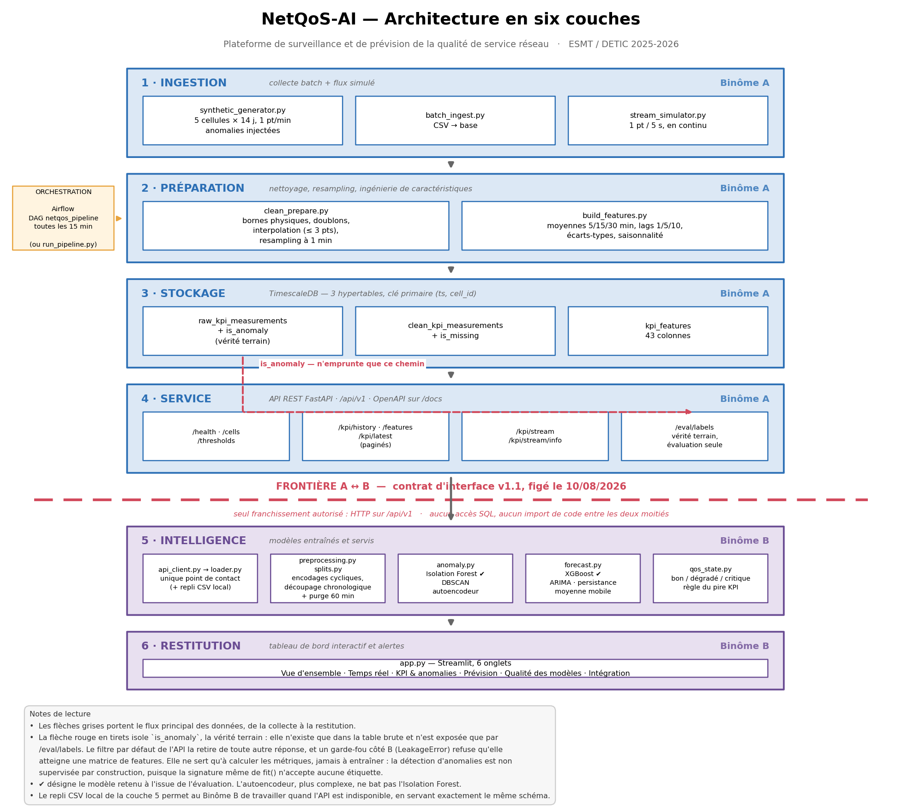

# Le problème

Une dégradation de qualité de service non détectée à temps se paie en
expérience utilisateur, puis en clientèle.

La supervision classique repose sur des **seuils fixes**. Nous les avons mesurés
sur nos données, plutôt que de les supposer insuffisants :

- ils classent **« critique » 42,5 % des instants normaux** ;
- ils laissent **14,2 % des anomalies réelles** sous leur radar ;
- ils déclenchent **une fausse alerte toutes les deux heures**.

::: notes
Ouvrir sur le chiffre, pas sur la technologie. Un exploitant qui reçoit une
alerte injustifiée quatre jours sur dix cesse de les lire — c'est le vrai
problème que le projet attaque.
:::

# Pourquoi un seuil fixe échoue

**Il ignore la variabilité normale.** Une charge de cellule à 90 % est banale à
l'heure de pointe et anormale à quatre heures du matin. Un seuil unique se
trompe dans les deux cas.

**Il ne voit que l'amplitude, pas la forme.** Une gigue anormalement irrégulière
à charge et latence normales ne franchit aucun seuil, et signale un problème.

Le référentiel pertinent n'est donc pas une constante, mais **l'écart au
comportement habituel de la cellule à cette heure-là**.

# Ce que nous avons construit

Une plateforme de bout en bout, démarrable en une commande.

| | |
|---|---|
| **Pipeline** | 5 cellules · 14 jours · 100 800 mesures · 43 caractéristiques par point |
| **Orchestration** | Airflow, toutes les 15 minutes |
| **API** | 9 endpoints REST documentés par OpenAPI |
| **Détection** | Isolation Forest — **F1 0,631**, **0,018 fausse alerte/h**, 9 épisodes sur 9 |
| **Prévision** | XGBoost multi-horizon — **−10 % / −15 % / −21 %** de MAE vs persistance |
| **Décision** | État QoS annoncé à 30 min, **82 % d'exactitude** |

# Architecture en six couches

::: notes
Deux éléments à pointer du doigt à l'écran : la flèche rouge en tirets, qui est
le chemin isolé de la vérité terrain ; et la frontière A ↔ B, traversée par une
seule flèche — l'appel HTTP.
:::

# Le contrat d'interface : trois règles

Figé au jalon J7, le 10 août 2026. Livrable commun évalué.

**1. La frontière ne se traverse qu'en HTTP.** Aucun accès à la base, aucun
import de code. Un seul fichier du volet B contient un appel réseau.

**2. La vérité terrain est isolée.** `is_anomaly` n'existe que dans la table
brute et n'est servie que par un endpoint réservé à l'évaluation.

**3. Une enveloppe de réponse commune** à tous les endpoints.

> C'est la règle 2 qui garantit que la détection reste **non supervisée**.

# Binôme A — le pipeline

Trois étapes, trois tables, une hypertable TimescaleDB chacune.

`raw_kpi_measurements` → nettoyage → `clean_kpi_measurements` → caractéristiques
→ `kpi_features`

- **génération synthétique paramétrée**, seule voie fournissant une vérité
  terrain pour évaluer la détection ;
- **nettoyage** : dédoublonnage, ré-échantillonnage à la minute, interpolation
  bornée, marquage `is_missing` ;
- **43 caractéristiques** par point : moyennes et écarts-types glissants,
  décalages, agrégats horaires, saisonnalité ;
- **écriture idempotente** (`ON CONFLICT DO UPDATE`), condition d'un pipeline
  réexécuté toutes les 15 minutes.

# Binôme A — service et orchestration

**API FastAPI**, 9 endpoints sous `/api/v1`, documentation OpenAPI générée.
Enveloppe commune, pagination.

**Airflow** : DAG `netqos_pipeline`, LocalExecutor, métadonnées en TimescaleDB.
Le DAG **importe** les fonctions du pipeline — aucune logique dupliquée entre
l'exécution ordonnancée et l'exécution locale.

**Conteneurisation** : cinq services, une commande.

::: notes
Insister sur le non-duplication : c'est ce qui garantit que les deux modes
d'exécution ne peuvent pas divergerar.
:::

# Binôme B — le protocole avant les modèles

Nous avons construit le protocole d'évaluation **avant** d'entraîner quoi que ce
soit. Choix contre-intuitif, et décisif.

Sur des séries temporelles, un découpage naïf produit des scores **excellents et
faux** : une caractéristique calculée sur une fenêtre de 60 minutes renseigne les
60 minutes suivantes.

- découpage **chronologique par cellule**, 60 / 20 / 20 ;
- **purge de 60 minutes** de part et d'autre de chaque frontière — la plus longue
  fenêtre présente dans les caractéristiques ;
- deux garde-fous levant des exceptions : `LeakageError`, `LabelAlignmentError` ;
- **60 tests** verrouillant ces invariants.

# Binôme B — détection d'anomalies

19 850 points de test · prévalence 1,51 % · 9 épisodes. Contre les seuils
fixes : **F1 × 12**, **fausses alertes ÷ 30** — sans jamais voir une étiquette.

| Détecteur | F1 | PR-AUC | Fausses alertes/h | Épisodes |
|---|---|---|---|---|
| Seuils du contrat | 0,051 | 0,023 | 0,553 | 9/9 |
| **Isolation Forest** | **0,631** | **0,586** | **0,018** | **9/9** |
| DBSCAN | 0,223 | 0,391 | 0,018 | 4/9 |
| Autoencodeur | 0,390 | 0,363 | 0,003 | 8/9 |

# Deux résultats contre l'attente

**Le modèle avancé ne bat pas la baseline.** L'autoencodeur obtient 0,363 de
PR-AUC contre 0,586. Conformément au §8.2 de la fiche, **il n'est pas déployé**.

**Le classement dépend du point de fonctionnement.** DBSCAN passe de F1 = 0,223
à 0,624 selon le seuil — un rapport de trois. Isolation Forest varie de 0,631 à
0,635 : il est insensible à ce choix, ce qui est une raison de plus de le
retenir.

::: notes
Un non-résultat correctement établi est un résultat. C'est le point que la fiche
demande explicitement au §8.2.
:::

# Binôme B — courbes précision-rappel

::: notes
La baseline par seuils reste au ras de l'axe sur toute la plage. C'est la
lecture la plus immédiate de l'écart.
:::

# Binôme B — prévision des KPI

Cinq KPI, trois horizons, approche multi-horizon directe. Le gain **croît avec
l'horizon** : à 5 minutes la valeur actuelle est déjà une bonne prédiction ; à
30 minutes, la structure apprise prend le dessus.

| Horizon | Gain de MAE vs persistance |
|---|---|
| 5 min | −10,0 % |
| 15 min | −14,6 % |
| 30 min | **−20,7 %** |

# Le résultat le plus instructif

XGBoost était d'abord **battu par la persistance** — la baseline qui prédit que
rien ne changera.

Cause : `packet_loss` est extrêmement asymétrique (médiane 0,63 %, max 79,6 %).
La perte quadratique par défaut préparait le modèle aux pics rares, alors qu'on
le mesurait en erreur **absolue**. La question à poser en premier n'était donc
pas « quels hyperparamètres ? » mais **« le modèle optimise-t-il ce que je
mesure ? »**.

| KPI | Asymétrie | Gain du changement de perte |
|---|---|---|
| `packet_loss` | 28,3 | **−41,9 %** |
| `latency` | 12,6 | −27,6 % |
| `cell_load` | −0,04 | −0,5 % |

# De la prévision à la décision

Prévoir cinq courbes n'aide pas un exploitant. Nous appliquons les seuils du
contrat aux **valeurs prévues**. Résultat **stable de 5 à 30 minutes** : tant
que la valeur prévue reste du bon côté du seuil, l'erreur est sans conséquence
sur la décision. L'annonce à 30 minutes est donc aussi fiable, et laisse dix
fois plus de temps pour agir.

| Horizon | Exactitude de l'état | Critiques manqués |
|---|---|---|
| 5 min | 82,1 % | 14,2 % |
| 15 min | 82,3 % | 13,9 % |
| 30 min | 82,1 % | 14,7 % |

# Le tableau de bord

Six onglets, alimentés par l'API avec repli automatique hors ligne.

Vue d'ensemble · **Temps réel** · KPI & anomalies · Prévision · Qualité des
modèles · **Intégration**

L'onglet *Intégration* rend l'état de la frontière A ↔ B visible à l'écran
plutôt que déductible des logs. Il a accéléré tous nos diagnostics.

**📷 Insérer ici une capture de l'onglet « Vue d'ensemble ».**

# Quatre échecs qui ne levaient aucune erreur

C'est notre principal apprentissage. Trois de ces défauts produisaient des
chiffres **plus flatteurs** que la réalité.

| Défaut | Effet silencieux |
|---|---|
| `/eval/labels` non rééchantillonné | prévalence 0 %, **toutes les métriques nulles** |
| Pagination sans `has_more` | **5 %** des étiquettes lues |
| Perte désaccordée de la métrique | modèle battu par la baseline la plus naïve |
| « Gain » d'optimisation de +3,9 % | **du bruit de graine**, quatre fois plus grand |

# La réponse : programmer la détection de l'absurde

Un système d'apprentissage n'a pas de bon sens. Il ne remarque pas qu'un jeu de
test sans aucune anomalie est absurde.

- **garde-fous** levant des exceptions explicites plutôt qu'un résultat nul ;
- **tests** verrouillant les invariants dont la violation serait silencieuse ;
- **comparaison systématique** du mesuré à l'attendu — prévalence attendue,
  volume attendu, sens attendu d'un gain ;
- **mesure du bruit de fond** avant d'interpréter un écart.

::: notes
Le garde-fou d'alignement a coûté quinze lignes. Sans lui, tout résultat du
rapport aurait dépendu de notre vigilance devant une prévalence affichée.
:::

# Pourquoi pas 90 % ? Le prix mesuré de la contrainte

Nous avons entraîné un **oracle supervisé** — modèle ayant accès aux étiquettes,
interdit par le contrat, **non déployé** — dans le seul but de chiffrer le
plafond. L'écart de **0,319** qui suit est le prix de la contrainte non
supervisée : les 90 % sont atteignables sur ces données, mais **seulement avec
les étiquettes**.

| Modèle | PR-AUC | F1 |
|---|---|---|
| Isolation Forest (non supervisé, retenu) | 0,586 | 0,631 |
| Oracle supervisé (interdit, non déployé) | **0,905** | 0,884 |

# Où se trouve le vrai progrès

La mesure ci-dessus **borne l'effort de réglage** : l'essentiel de l'écart vient
de la contrainte, pas de la configuration. Deux méthodes indépendantes
convergent — l'oracle, et le bruit de graine.

Elle indique aussi **où chercher** : dans les données, pas dans le modèle.

- 9 épisodes seulement dans le segment de test — un épisode manqué déplace le
  rappel par épisode de **11 points** ;
- anomalies majoritairement d'amplitude, peu de formes.

# Limites assumées

- **densité et diversité d'anomalies** insuffisantes — première priorité ;
- **seuils QoS v1.1 déséquilibrés** : critique 43,1 % du temps, bon 8,3 %.
  Diagnostic transmis, contrat **non modifié unilatéralement** ;
- **pipeline non incrémental** — idempotent, mais il retraite tout l'amont ;
- **Prophet et LSTM non évalués** — choix de périmètre documenté, pas un
  résultat ;
- **le détecteur n'explique pas** : il signale l'atypique, sans en désigner la
  cause.

# Perspectives

**Enrichir le générateur** en types et en densité d'anomalies — c'est ce qui
améliorerait le plus la mesure, et probablement le modèle.

**Attribuer l'anomalie par KPI**, pour transformer une alerte en diagnostic.
Meilleur rapport apport / effort.

**Fermer la boucle de l'alerte** : notifier, puis journaliser les acquittements
de l'exploitant — qui sont, à terme, les étiquettes que nous n'avions pas.

# Ce que nous retenons

**Un contrat d'interface ne suffit pas défini : il doit être vérifié par les
deux parties.** Quatre de nos sept difficultés viennent d'un écart au contrat
que rien ne signalait.

**Un écart doit être comparé au bruit de la mesure avant d'être interprété comme
un effet.** L'oracle et la variance par graine n'ont amélioré aucun modèle : ils
ont rendu les résultats défendables.

**Le point de départ n'était pas 100 %, c'étaient les seuils fixes.** F1 de 0,051
à 0,631, fausses alertes divisées par trente, sans une seule étiquette.

# Démonstration

**📷 Basculer sur la plateforme — déroulé détaillé dans `reports/deroule_demo.md`.**

1. la stack démarre en une commande ;
2. l'API sert les données, documentation OpenAPI ;
3. le tableau de bord lit l'API — onglet *Intégration* ;
4. le flux temps réel arrive et la détection s'y applique ;
5. la prévision annonce l'état QoS à 30 minutes.

# Merci

Questions.

Documents de référence dans le dépôt : rapport de projet, rapport d'évaluation
des modèles, rapport d'analyse exploratoire, notice du tableau de bord, guide de
vérification en cinq niveaux.

# Diapos de réserve

Les diapos suivantes ne sont pas projetées : elles répondent aux questions les
plus probables.

# Réserve — pourquoi Isolation Forest et pas l'autoencodeur ?

Sur 23 caractéristiques et un régime normal bien échantillonné, l'hypothèse
géométrique d'Isolation Forest — les anomalies sont isolables par peu de coupes
aléatoires — est mieux adaptée que l'apprentissage d'une variété de
reconstruction.

L'autoencodeur obtient 0,363 de PR-AUC contre 0,586. Le §8.2 de la fiche exige
qu'un modèle avancé batte la baseline pour être déployé : il ne la bat pas, donc
il n'est pas déployé. Il reste dans le code et dans l'évaluation.

# Réserve — 2 000 arbres, pourquoi ?

Pour la **stabilité**, pas pour la moyenne. L'écart entre configurations
d'hyperparamètres était de 0,0238 — plus petit que le bruit de graine à 300
arbres. Le seul gain accessible était la réduction de variance.

| Arbres | PR-AUC moyenne | Écart-type | Étendue sur 6 graines |
|---|---|---|---|
| 300 | 0,5727 | 0,0315 | 0,0909 |
| 1 000 | 0,5945 | 0,0127 | 0,0317 |
| **2 000** | **0,5984** | **0,0053** | **0,0153** |

# Réserve — comment savez-vous qu'il n'y a pas de fuite ?

Trois mécanismes, tous vérifiables :

- **purge de 60 minutes** dimensionnée sur la plus longue fenêtre glissante
  présente dans les caractéristiques du Binôme A ;
- **`fit()` n'accepte aucun argument d'étiquettes** — entraîner sur `is_anomaly`
  exigerait de modifier l'interface des classes, donc apparaîtrait dans un diff ;
- **60 tests** dont un vérifie, pour chaque cellule, que le dernier horodatage
  d'entraînement précède le premier de test d'au moins la durée de purge.

# Réserve — les seuils QoS sont-ils faux ?

Ils sont **déséquilibrés**, et le mécanisme est arithmétique.

Chaque KPI est classé « bon » entre 26 % et 82 % du temps, ce qui est
raisonnable. Mais la règle du pire KPI exige que **les cinq** le soient
simultanément : la part de temps « bon » global tombe à 8,3 %.

Les seuils ont été calibrés KPI par KPI, sans tenir compte de la règle qui les
combine. Deux options de révision ont été transmises ; le contrat étant gelé,
nous appliquons la v1.1 telle quelle dans tout le code.

# Réserve — que se passe-t-il si l'API tombe ?

Trois modes, sélectionnables par `NETQOS_DATA_SOURCE`. La source locale a été
vérifiée **numériquement équivalente** à l'API : écart maximal nul sur les 43
caractéristiques.

| Mode | Comportement |
|---|---|
| `api` | exclusif — échoue explicitement (tests d'intégration) |
| `local` | recalcule les caractéristiques depuis les CSV, sans appel réseau |
| `auto` | API en priorité, repli **annoncé** à l'écran |

# Réserve — le pipeline tient-il à volume plus élevé ?

**Pas en l'état.** Le nettoyage et le calcul des caractéristiques relisent la
table amont en entier à chaque tick de quinze minutes — environ trois minutes
pour 100 000 lignes.

Le paramètre `since` existe dans les deux fonctions, mais n'est transmis ni par
le script d'orchestration ni par le DAG.

L'**idempotence, elle, est acquise** : c'est ce qui rend ce retraitement sans
danger, seulement coûteux.
